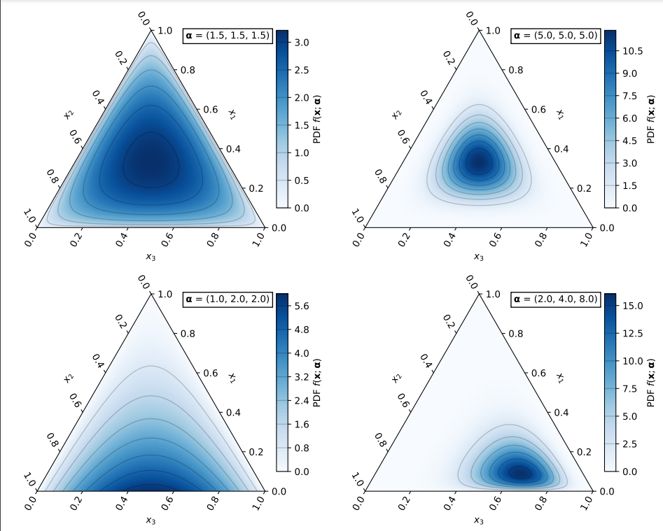

# Exo Weights API  v0.1.0

Uses an API with a predictive model to give optimality of weights, uses a redis backend.

The predictive model is based on the Dirichlet distribution which is a random variable whos set space operates on a convex combination of weights. Aka. Numbers that add to 1, and are all greater than or equal to 0. 

This distribution is useful as it is able to model ring partitions for exo reliably well, and has parameters to concentrate weights on certain nodes in the partition over others.





The reasoning behind this model is that an exo partition of nodes constitutes too many variables to reliably keep track of i.e. Ghz of a cpu, brand of laptop/computer. Memory does not necessarily equal performance, and the latency between each computer may differ depending on the cable, and connection. 

The model will search for the space of optimal partition weights naturally and converge over time statistically using a stochastic algorithm. 

## Usage

The api is split into a few methods, which will be updated over time. The api is built using docker and docker compose.

To build it run

```bash
make build_api
```

To launch the server run: 

```bash
make api 
```

You will get a log that displays the following: 


```bash 
docker compose -f "./dockers/docker-compose.yml" run -p 8000:8000 api
[+] Creating 1/0
 ✔ Container red  Running                                                                                                             0.0s 
INFO:     Will watch for changes in these directories: ['/home/app_user/app']
INFO:     Uvicorn running on http://0.0.0.0:8000 (Press CTRL+C to quit)
INFO:     Started reloader process [1] using WatchFiles
INFO:     Started server process [8]
INFO:     Waiting for application startup.
INFO:     Application startup complete.
```


## Types of Requests

- weights-update: post request, given a set of weights for a partition, enter it within a database, do a compare and check to see if your partition is the best.
- weights-update-delete: post request, given a session id, delete all weights and data associated with that id. useful for clearing previous data.
- weights-gen: post request, given a session id, generate a new vector of weights constituting a partition using a dirichlet distribution. 


## Examples 

There is a pytest called `test_generation.py` which goes through an iterative scheme to find the "optimal" weight partition as a mock request. It basically uses all three of the endpoints to create an optimization feedback loop. 


### weights_update 

The weights update api will take in the following data schema,

```json 
{   
    "session_id": "007",
    "number_of_nodes": 2,
    "max_weightings": [1.0, 1.0],
    "weights": [0.5,0.5],
    "performance_metric": 4.0
}
```
session_id is a custom moniker for your optimization session, you can set it to any string. 

The max_weightings are set to 1.0 because each of the nodes or computers can handle the full memory footprint of the model you are trying to run. These denoted "max_weightings" will change based on the memory restrictions of the node. For example if node 1 can only handle 25% of the model memory footprint then max_weightings -> [0.25, 1.0]. 

The weights are the current settings for partition. 

The performance_metric is the value you are trying to optimize exo for. For example if latency is your interest, i.e. time to first token (ttft), then performance_metric will be ttft. Another performance metric to optimize for is tokens per second (tps). 

The number of nodes keeps track of how many computers are connected to exo, and must match the length of max weightings and weights.

The response of this api looks something like this: 

```json
{
    "message": "/weights_update/: SUCCESS, no change in best weights",
    "best_perf_metric": 10.0,
    "best_weights": [
        0.25,
        0.75
    ],
    "best_out_of": 2
}
```

This implies that the weights 0.5,0.5 tied to the performance metric 10.0 are not the best set of weights the api has seen. It will by default return the best partition weight set of 0.25,0.75 and the best performance of 10.0 tied to said vector. best_out_of keeps track of the number of partition vectors you have to compare. For example here we have only 2 comparisons, while in the next response you have 4.


If you manage to beat the best weights, the response would look something like this

```json
{
    "message": "/weights_update/: SUCCESS, best weights updated",
    "best_perf_metric": 100.0,
    "best_weights": [
        0.2,
        0.8
    ],
    "best_out_of": 4
}
```


### weights_update_delete

Is fairly self explaintory, it just deletes all the data associated with the session_id. Here is an example request body example (it is the same as all of them):  

```json
{   
    "session_id": "blah",
    "number_of_nodes": 2,
    "weights": [0.5, 0.5],
    "max_weightings": [1.0, 1.0],
    "performance_metric": 20

}
```

The response will look something like this: 

```

{
    "message": "/weights_update_delete/: SUCCESS, key session_blah deleted"
}
```

So session "blah" will have all its data deleted from the redis db. 


### weights_gen

This is by far the most important endpoint in the api, it is an api that actually generates weights for you according to the dirichlet model. The body of the post request is the exact same as the others: 

```json
{   
    "session_id": "blah",
    "number_of_nodes": 2,
    "weights": [
            0.88,
            0.12
    ],
    "max_weightings": [1.0,1.0],
    "performance_metric": 20
}
```

The response will look something like this:


```json
{
    "message": "/weights_update/: SUCCESS, not enough data, generated random weights",
    "weights": [
        0.2820337529683144,
        0.7179662470316857
    ]
}

```

which will give you new weights to try out for a partition!

The example `test_generation.py` is an example on how you can create a feedback loop. 